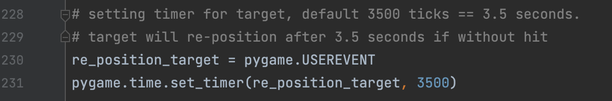
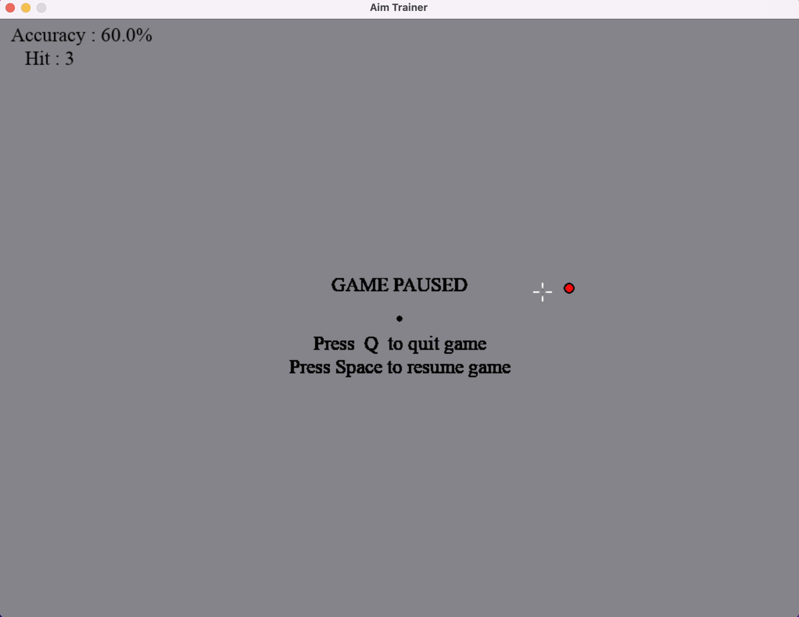
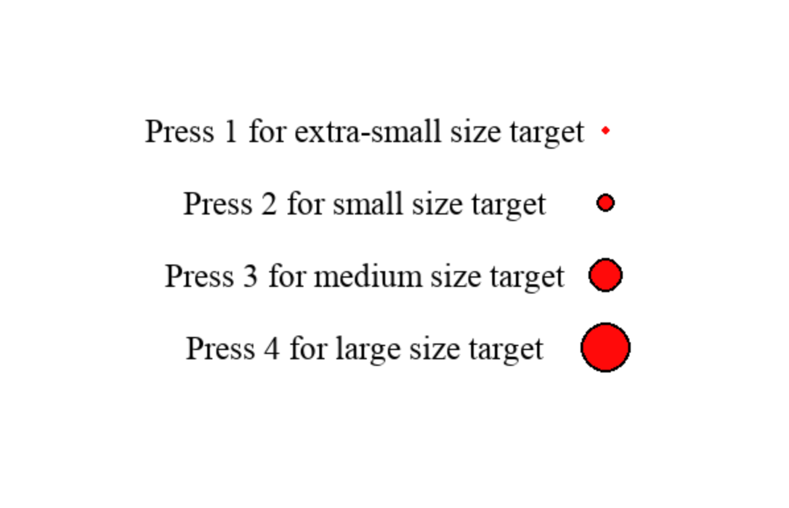
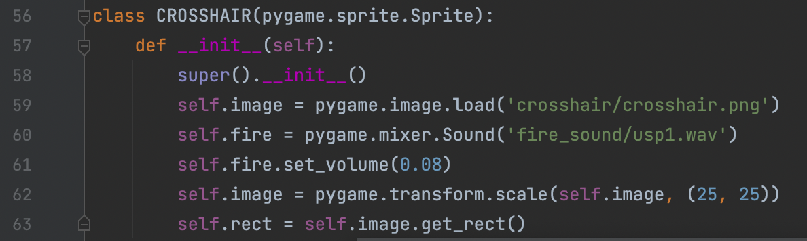

## CLICK HERE TO SEE DEMO: https://youtu.be/qRXtcQZSapc
    ** background music was not recorded in the video. 
    
### I am a big fan of CSGO, and I found it inconvenient to train my aim without entering into the actual game. So I decided to make this game/trainer. I hope you like it and find it useful as well.

There are several things to keep in mind if you want to change the gameplay: 
 
 * Accuracy is calculated as: the number of hit targets/number of shots fire
    - if you did not fire and re-position the target will not count toward accuracy.
  
 * The default time for the target to re-position is 3.5 seconds
    - If you hit the target before the expired time, the target will re-position right away, but the 3.5 seconds will not re-set.
    - To change the re-position timer, you can change LINE 231
    - For example: 3500 is 3.5 seconds, 2000 is 2 seconds.

 * You can change the size of the target!! **(New Update)**
    - the default crosshair is set to 2, which is small
    - you can go into Paused, then Press C to choose the crosshair size you like

 * SPACE key is the default paused command.
 * Default firing sound is obtained from CSGO, handgun: USPS
   - you can change the firing sound and crosshair pic on LINE 59 and 60 by loading different files.

