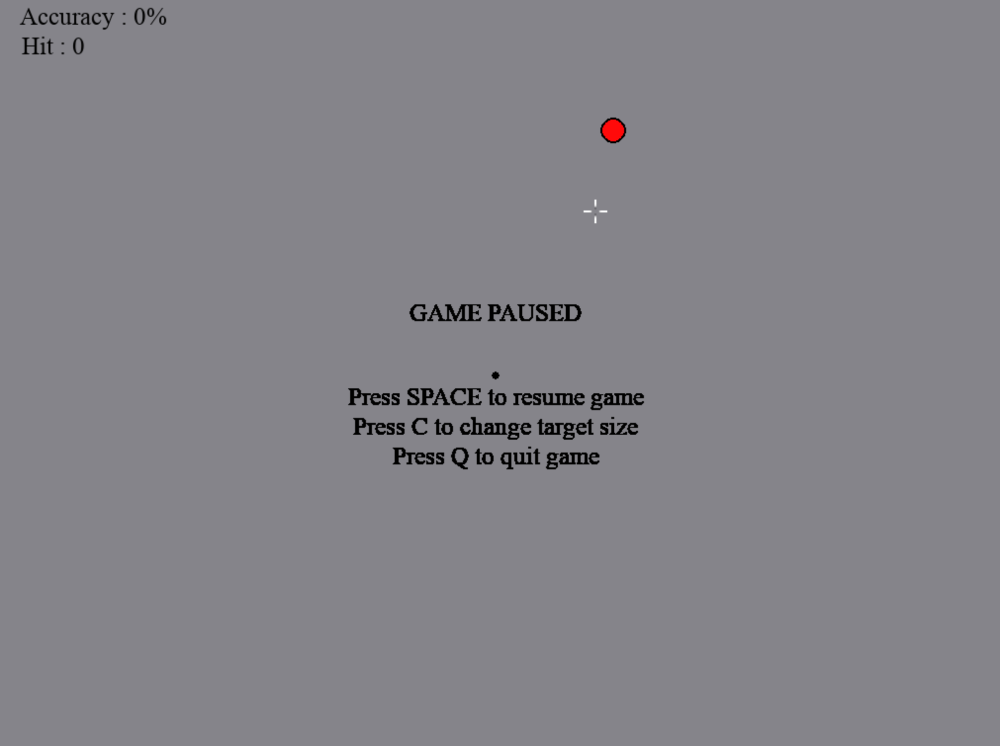

## CLICK HERE TO SEE DEMO: https://youtu.be/qRXtcQZSapc
    ** background music was not recorded in the video. 
    
### This is my third personal project. I am a big fan of CSGO, and I found it difficult to train my aim without entering into the actual game. So I decided to make this small game! I hope you like it and find it useful as well.

There are several things to keep in mind if you want to change the gameplay: 
 
 * Accuracy is calculated as: the number of hit targets/number of shots fire
    - if you did not fire and re-position the target will not count toward accuracy.
 * The default time for the target to re-position is 3.5 seconds
    - If you hit the target before the expired time, the target will re-position right away, but the 3.5 seconds will not re-set.
 * You can adjust the hitbox within the target
    - the default hitbox is set to: center of target +- 3 for both X and Y axis
 * SPACE key is the default paused command.

